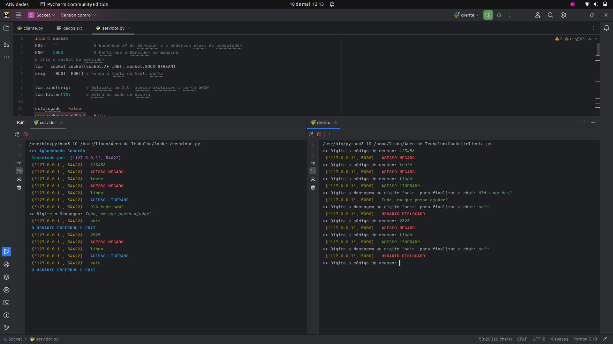

# Socket-em-python

Servidor e cliente socket escrito em Python

## Inicando o projeto

1 - Primeiro, certifique-se que tenha o python instalado (versão mínima recomendada 3.10.0):

2 - Faça o clone do projeto e execute o servidor e depois o cliente, para que possa ver o resultado

